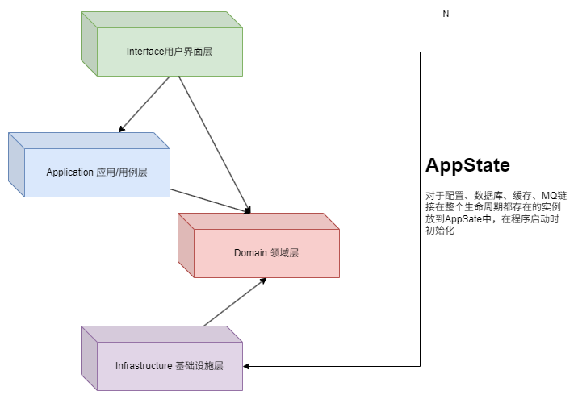

# MGR（motor getting rusty，锈化动力）

关于DDD请查看`customer`模块，本项目集成了各个客户端配置，充分利用Rust类型系统 ，无论作为学习还是生产模板都是不错的选择，重构代码见其他分支

## 架构



* AppState存储全局状态，Extension请求级注入
* repository必须标记`Clone + Send + Sync + 'static`
  * 想要在多线程间安全的被move所有权必须实现`Send`，使用Arc包装到AppState必须实现`Sync`共享状态并发，Axum使用要求注入的数据实现了`Clone`，`'static`表示这个仓储在整个生命周期都不被drop()
* main函数中的代码越少，测试死区就越小
* 一个领域应包含所有必须作为一个单一、原子操作的一部分一起改变的实体
  * 数据库的原子操作要么全部成功要么全部失败，但是领域并不关心仓储实现细节，在领域服务层面的原子操作代表更改必须同时发生，也就是聚合根维护对象的一致状态

## 技术栈

* Rust，采用DDD领域驱动设计，通过依赖倒置和依赖注入解耦
* Config-rs，使用config加载配置文件
* Axum，Web框架
* Sea-orm，ORM框架
* Redis、Postgres、Elasticsearch
* Swagger-ui，整合OpenAPI
* Tracing，日志追踪
* JWT鉴权

## 项目简介

`MGR`是一个基于DDD清晰架构设计的web3D购车商城，采用Docker、Debezium、Postgres、kafka等技术，注重数据的最终一致性，通过发件箱模式实现事件驱动

## 架构

* Interface：适配器层，有的地方叫Adapter层，用于处理页面请求的Controller，对应主动适配器
  * api：web接口
  * cmd：命令行接口
* Application：应用层，事务、仓储（通过领域中的repository），协调领域服务
  * DTO：command、query、DTO定义
  * use_case：用例（应用服务）
  * EventHandler：和EventListener类似，用于简单事务
  * EventListener：对于一些长事务，可能会几小时甚至几天才会完成，通过事件来保证最终一致性
  * QueryHandler:
* Domain：领域服务，单一职责原则，领域服务不应该进行存储，只负责处理、封装业务逻辑，在应用层进行存储
  * model：领域模型，包含聚合、DP（Domain Primitive）或VO（值对象）
    * AggregateRoot：聚合根负维护对象的一致状态，可序列化，必须声明id
  * repositories：仓储接口，在Infrastructure实现
  * service：领域能力
  * event：事件定义，除了存储当前聚合的状态还可以根据过去发布的Event重建状态
* Infrastructure：对应被动适配器
  * config：各种配置
  * client：数据库、MQ客户端
  * persistence：仓储实现
  * event_processing：由本应用生成的事件需要被分派
  * PO（Persistence Object）：持久化对象，有的叫DO（Data Object）数据对象，都是和表一 一对应的对象
* shared：公共模块，有的项目叫common

> 本项目仿造COLA架构实现：<https://github.com/alibaba/COLA>，client相关代码整合到`application`和`interface`
>
## 快速开始

安装sea-orm-cli

```cmd
cargo add seaorm-cli
```

运行迁移

```cmd
sea-orm-cli migrate up
```

删除所有表重新迁移

```cmd
sea-orm-cli migrate fresh
```

启动应用

```cmd
cargo run
```

## 如何判断业务属于应用服务、聚合根还是无法归属于聚合根的领域服务？

### 聚合根

聚合根是领域模型中具有独立生命周期的核心对象，对聚合根状态发生变化的业务都属于聚合根

* Order聚合根：
  * 创建订单：当用户下单时，创建一个新的订单实例，设置订单相关基本属性，这个操作聚焦于构建聚合根自身的初始状态，属于聚合根
  * 修改订单状态：订单在整个生命周期会经历不同的状态变化，如“已创建”、“已支付”、“已发货”、“已完成”、“已取消”等状态，这种引起聚合状态变化的操作可以归属于聚合根
* Product聚合根：
  * 更新商品基本信息：修改商品基本属性，不涉及复杂的业务逻辑验证码，仅仅对聚合根状态进行变更，可以作为聚合根充血服务，由聚合根维护自身状态的合法性和一致性
  * 管理商品库存（简单场景）：增减聚合根属性，并不涉及复杂的库存分配规则、与其他聚合根对策关联验证，可以归属于聚合根
* Customer聚合根：
  * 修改客户信息（简单情况）：修改用户名、头像等信息，不涉及复杂业务规则验证（不需要验证唯一性），仅对聚合根自身状态修改，可以归属于聚合根

### 领域服务

领域服务用于处理涉及多个聚合根协作或具有复杂业务逻辑的操作

1. **涉及多个聚合根的业务**

* 下单流程处理：下单不仅仅是创建聚合根那么简单，还需要验证库存是否充足、根据客户（Customer聚合根）的会员等级、优惠券计算订单总价、折扣等业务规则。这个下单流程涉及多个聚合根的交互以及复杂的业务逻辑协调，适合作为领域服务
* 退货退款流程处理：退货退款涉及多方面的验证，需要检查订单所处的状态是否符合退货退款条件（是否已过退货期限），需要更新商品（Product聚合根）的库存信息（退货商品重新入库），还要处理客户（Customer聚合根）的支付（Payment聚合根）等退款等操作，整个流程跨越了多个聚合根并且具有复杂的业务规则和外部系统的交互，属于典型的领域服务操作

2. **复杂业务规则校验的业务**

* 商品促销验证：电商系统中各种促销活动，如满减、折扣、赠品等促销规则。当客户（Custoemr聚合根）添加商品（Product聚合根）到购物车（Cart聚合根）或者客户（Customer聚合根）下单（Order聚合根）时，需要验证商品（Product聚合根）是否满足促销规则，可能涉及复杂的业务规则判断，比如不同商品满减规则不同、某些商品组合才能享受特定折扣等，并且要根据促销规则计算最终的订单（Order聚合根）价格。这种复杂的促销规则验证和操作跨越了多个商品聚合根以及订单相关的业务逻辑，适合作为领域服务

## 应用服务（用例）

应用服务主要负责协调领域服务以及外部系统（用户界面、外部接口）的交互。进行业务流程的整体编排

1. **业务流程编排**

* 完整购物流程：用户浏览商品，将商品添加到购物车（涉及购物车相关的业务逻辑，调用领域服务处理商品数量、库存等验证），再到下单（调用下单的领域服务）以及后续的支付（调用支付系统，协调领域服务和外部接口）、物流跟踪（与物流系统的交互）等整个购物流程的串联和协调，由应用服务来完成
* 用户注册登录流程处理：用户注册时需要从参数中收集用户信息（转换为领域模型），然后调用领域服务来验证输入信息的合法性（如验证是否唯一需要查询用户仓储属于领域服务），创建聚合根并保存到数据库（通过领域仓储Repository）等一系列操作；登录过程需要接受用户凭据（账号密码），调用领域服务验证凭据有效性，处理登录后的会话操作（缓存Session）等，这些步骤的编排流程由应用服务来负责对外提供统一的接口

2. **与外部接口交互适配**

* 对接支付系统：电商系统需要与外部的支付平台进行交互来完成订单支付操作。应用服务负责将内部的订单支付请求（订单金额、客户信息等必要数据，这些数据来自于领域聚合根和领域服务处理后的结果）按照支付平台的接口规范进行封装和适配，发送请求到支付平台，并处理支付平台的响应

## 命令和查询

命令和查询通过事件解耦

* 命令：表达意图，想要做什么和基于该意图所需的信息
* 查询：简单查询复用基础设施实体或复用领域repository，复杂查询新建query_model从基础设施查，查询方式可以采用原始sql

## 项目规约

| CRUD     | 命名约定                                             |
| -------- | ---------------------------------------------------- |
| 新增     | Create                                               |
| 添加     | Add                                                  |
| 删除     | Remove(Application/Domain)，Delete（Infrastructure） |
| 查询单个 | Find                                                 |
| 查询多个 | List                                                 |
| 分页查询 | Page                                                 |
| 统计     | Count                                                |

## 后台管理（TODO）

* 首页
  * 订单数
  * 营销额
  * 商品总览
  * 订单统计
* 商品
  * 商品列表
  * 添加商品
  * 商品分类
  * 商品类型
  * 品牌管理
* 订单
  * 订单管理
  * 订单设置
  * 退货申请处理
  * 退货原因设置
* 营销
  * 优惠券列表
  *
* 权限
  * 用户列表
  * 角色列表
  * 菜单列表
  * 资源列表

## 数据库

* SKU (Stock Keeping Unit) ：**库存量单位**，是物理上不可分割的最小存货单元，用于库春管理，SKU通常表示：规格、颜色、款式
  * 黑色、500公里续航的电车是一个SKU
  * 银色、800公里续航的电车是一个SKU
* item：**单品**，展示和销售的基本单位，商品条目或单个商品，每一个具体的商品都是一个 item，用于订单管理和库存跟踪
* SPU (Standard Product Unit) ：**标准产品单元**，是商品聚合的最小单元，是一组**可复用、易检索**的**标准化信息的集合**，是一组具有共同属性的商品的集合
  * 电车是一个SPU
  * 油车是一个SPU
  * 机油是一个SPU
  *

## CAP

|特性|描述|典型系统|
|-|-|-|
|​C​​onsistency(一致性)|所有节点访问同一份最新数据|银行系统|
|​A​​vailability(可用性)|每次请求都能获得响应（不保证最新数据）|CDN、AP型数据库|
|​P​​artition tolerance(分区容错性)|系统在网络分区时仍能运行|分布式系统必备|

### 三种可能组合

1、CA系统：

* 单机数据库：MySQL、PostgreSQL（无网络分区时
* 代价：无法应对网络故障，不适合分布式环境

2、CP系统

* 网络分区时拒绝写入，保证数据一致性
* 代价：可用性降低，适合分布式环境

3、AP系统（本项目重点）

* 网络分区时返回旧数据，保证服务可用
