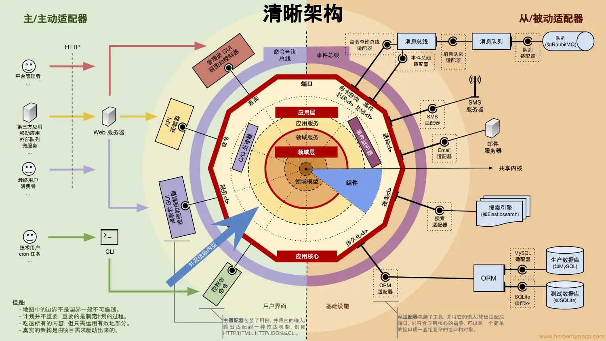

## MGR（motor getting rusty，锈化动力）

关于配置请查看`customer`模块，本项目集成了各个客户端配置，充分利用Rust类型系统 ，无论作为学习还是生产模板都是不错的选择

## 架构

## 技术栈

* Rust，采用DDD领域驱动设计
* Config-rs，使用config加载配置文件
* Axum，Web框架
* Sea-orm，ORM框架
* Redis、Postgres、Elasticsearch
* Swagger-ui，整合OpenAPI
* Tracing，日志追踪
* JWT鉴权
* TONIC，RPC通信

## 项目简介

`MGR`是一个基于DDD清晰架构设计的web3D购车商城，采用Docker、Elasticsearch、Kubernetes等技术

## 架构

* Interface：适配器层，有的地方叫Adapter层，用于处理页面请求的Controller，对应主动适配器
  * api：web接口
  * cmd：命令行接口
* Application：应用层，事务、仓储（通过领域中的repository），协调领域服务
  * DTO：command、query、DTO定义
* Domain：领域服务，单一职责原则，领域服务不应该进行存储，只负责处理、封装业务逻辑，在应用层进行存储
  * model：领域模型，包含聚合、DP（Domain Primitive）或VO（值对象）
  * repositories：仓储接口，在Infrastructure实现
  * service：领域能力
  * event：事件定义
* Infrastructure：对应被动适配器
  * config：各种配置
  * client：数据库、MQ客户端 
  * persistence：仓储实现
  * PO（Persistence Object）：持久化对象，有的叫DO（Data Object）数据对象，都是和表一 一对应的对象
* shared：公共模块，有的项目叫common

## 后台管理（TODO）

* 首页
  * 订单数
  * 营销额
  * 商品总览
  * 订单统计
* 商品
  * 商品列表
  * 添加商品
  * 商品分类
  * 商品类型
  * 品牌管理
* 订单
  * 订单管理
  * 订单设置
  * 退货申请处理
  * 退货原因设置
* 营销
  * 优惠券列表
  * 
* 权限
  * 用户列表
  * 角色列表
  * 菜单列表
  * 资源列表

## 数据库

* SKU (Stock Keeping Unit) ：**库存量单位**，是物理上不可分割的最小存货单元，用于库春管理，SKU通常表示：规格、颜色、款式
  * 黑色、500公里续航的电车是一个SKU
  * 银色、800公里续航的电车是一个SKU
* item：**单品**，展示和销售的基本单位，商品条目或单个商品，每一个具体的商品都是一个 item，用于订单管理和库存跟踪
* SPU (Standard Product Unit) ：**标准产品单元**，是商品聚合的最小单元，是一组**可复用、易检索**的**标准化信息的集合**，是一组具有共同属性的商品的集合
  * 电车是一个SPU
  * 油车是一个SPU
  * 机油是一个SPU
